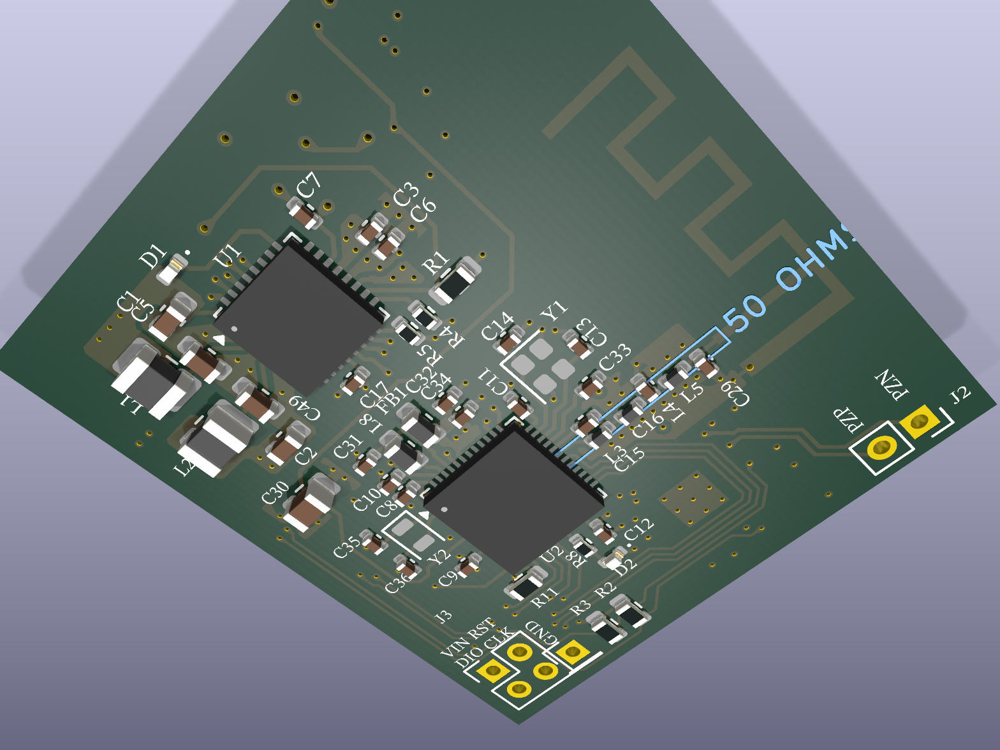
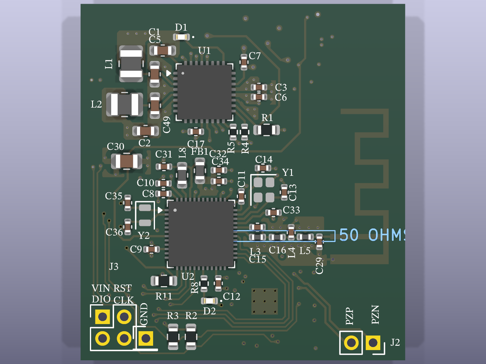
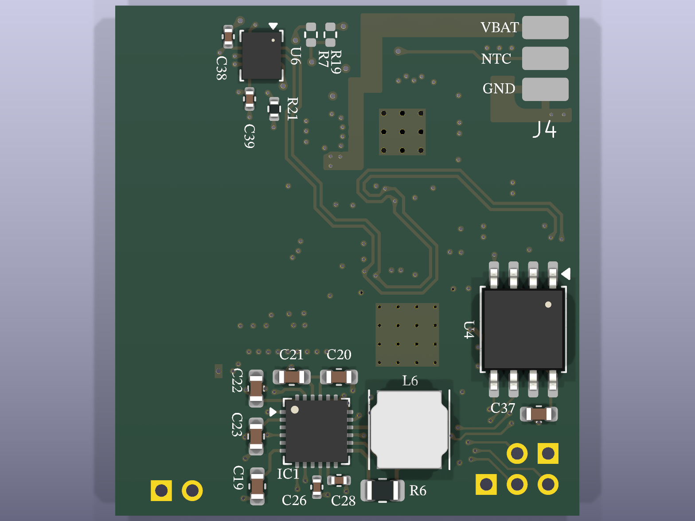
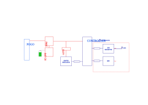

# HapticGPS — Wearable Haptic Navigation Board

<p align="center">
  
</p>

<p align="center">
  
  
  
  
</p>

A compact 4-layer wearable PCB that delivers directional haptic feedback via a piezoelectric actuator. The board combines a Bluetooth Low Energy SoC, a 6-axis IMU, a piezoelectric haptic driver, non-volatile FRAM storage, and a LiPo power management IC — all in a **30 × 33 mm** footprint.

---

## PCB Views

| Top | Bottom |
|:---:|:---:|
|  |  |

---

## Key Features

- **Ultra-low-power BLE 5.4** SoC (Nordic nRF54L15) with on-board PCB trace antenna
- **Piezoelectric haptic feedback** driven by a dedicated high-voltage driver IC (Bosch BOS1921)
- **6-axis IMU** (ST LSM6DSV) for orientation and motion sensing
- **8 Mbit FRAM** (Cypress CY15B108QN) for fast, wear-unlimited non-volatile storage
- **Integrated LiPo charger + dual DCDC + LDO** (Nordic nPM1300 PMIC)
- **4-layer stackup** for clean power planes and antenna isolation
- SWD debug/programming header

---

## Hardware Specifications

| Parameter | Value |
|---|---|
| PCB size | 30 × 33 mm |
| Stackup | 4-layer (F.Cu / In1.Cu / In2.Cu / B.Cu) |
| Board thickness | 1.526 mm |
| Design tool | KiCad 9.0 |
| Revision | V1.0.0 |

---

## Block Diagram

<p align="center">
  
</p>

---

## Bill of Materials (Key ICs)

| Ref | Part | Description |
|-----|------|-------------|
| U1 | [Nordic nPM1300](https://www.nordicsemi.com/Products/nPM1300) | PMIC — LiPo charger, dual buck, LDO |
| U2 | [Nordic nRF54L15-QFAA-R](https://www.nordicsemi.com/Products/nRF54L15) | BLE 5.4 SoC, Arm Cortex-M33 |
| U3 | [Bosch BOS1921CQR](https://www.bosch-sensortec.com) | Piezoelectric haptic driver |
| U4 | [Cypress CY15B108QN](https://www.infineon.com/cms/en/product/memories/f-ram-ferroelectric-ram/serial-f-ram/cy15b108qn/) | 8 Mbit SPI FRAM |
| IC1 | [ST LSM6DSV80XTR](https://www.st.com/en/mems-and-sensors/lsm6dsv80x.html) | 6-axis IMU (accel + gyro) |
| Y1/Y2 | Crystal | MCU system & RTC clock references |

---

## Connectors & Interfaces

| Designator | Function | Signals |
|---|---|---|
| J3 | SWD debug header | VIN, RST, DIO, CLK, GND |
| J4 | LiPo battery | VBAT, NTC, GND |
| J2 | Piezo actuator | PZP, PZN |

---

## Getting Started

### Prerequisites

- [KiCad 9.0+](https://www.kicad.org/) to open schematics and PCB layout
- A LiPo cell (connected via J4)
- A piezoelectric actuator (connected via J2)
- An SWD programmer (e.g. J-Link, nRF9160 DK) for firmware flashing

### Opening the Project

```bash
git clone <repo-url>
cd HapticGPS/HapticGPS
kicad HapticGPS.kicad_pro
```

### Generating PCB Renders

Renders are generated with the KiCad CLI:

```bash
# Top view
kicad-cli pcb render \
  --output Doc/renders/top.png \
  --width 1600 --height 1200 \
  --side top --quality high --floor \
  HapticGPS/HapticGPS.kicad_pcb

# Bottom view
kicad-cli pcb render \
  --output Doc/renders/bottom.png \
  --width 1600 --height 1200 \
  --side bottom --quality high --floor \
  HapticGPS/HapticGPS.kicad_pcb

# Isometric view
kicad-cli pcb render \
  --output Doc/renders/iso.png \
  --width 1600 --height 1200 \
  --quality high --floor --perspective \
  --rotate "30,0,45" \
  HapticGPS/HapticGPS.kicad_pcb
```

---

## Repository Structure

```
HapticGPS/
├── HapticGPS/
│   ├── HapticGPS.kicad_pro       # KiCad project file
│   ├── HapticGPS.kicad_pcb       # PCB layout
│   ├── HapticGPS.kicad_sch       # Top-level schematic
│   └── modules/
│       ├── controller.sch.kicad_sch     # MCU + FRAM
│       ├── power.kicad_sch              # PMIC circuit
│       ├── piezoelectric_driver.kicad_sch  # Haptic driver
│       └── (imu.kicad_sch)              # IMU sub-sheet
└── Doc/
    ├── architecture/
    │   └── Basic_architecture.svg
    └── renders/
        ├── top.png
        ├── bottom.png
        └── iso.png
```

---

## License

This hardware design is released under the **CERN Open Hardware Licence Version 2 — Strongly Reciprocal (CERN-OHL-S v2)**.  
See [`LICENSE`](LICENSE) for the full text, or visit [ohwr.org/cern_ohl_s_v2.txt](https://ohwr.org/cern_ohl_s_v2.txt).
